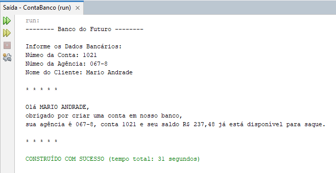

# Conta Bancária
## Projeto Java Básico
#### Por: DIO (Digital Innovation One)

### Sobre o Projeto

Um projeto básico em Java 17 usando Netbeans que foca em organização e manipulação de variáveis primitivas e de classe. Inclui formatação e conversão de strings, e utiliza a classe Scanner para entrada/saída de dados e a Classe System para exibição no terminal.

##### About the project

A basic project in Java 17 using Netbeans that focuses on organizing and manipulating primitive and class variables. It includes string formatting and conversion, and uses the Scanner class for data input/output and the System Class for display on the terminal.

### Ferramentas de Desenvolvimento 
##### (Development Tools)

* Netbeans
* JDK (Java 17)

### Dados do Projeto

* Nome do Projeto: ContaBanco
* pacote: contabanco
* Arquivo: ContaTerminal.java
* Classe: ContaTerminal
* Método Principal: Main

##### Project data

* Project Name: ContaBanco
* package: contabanco
* File: ContaTerminal.java
* Class: ContaTerminal
* Main Method: Main

### Técnicas Utilizadas

* Classe Scanner: Leitura/ Escrita
* Variáveis:
    * Do Tipo Primitivo (INT, DOUBLE)
    * Do Tipo Classe (String)
* Concat: Concatenação de Strings
* Format: Formatação de String
* Método valueOf: Converte para String
* Método toUpperCase: Tranforma Texto em Maiúsculo
* Classe System: Métodos de Saída

##### (Techniques Used)

* Scanner Class: Reading/Writing
* Variables:
     * Of Primitive Type (INT, DOUBLE)
     * Class Type (String)
* Concat: String Concatenation
* Format: String Formatting
* valueOf method: Converts to String
* toUpperCase method: Transforms text into uppercase
* System Class: Output Methods

### Autor
##### (Project Author)
#### Katarine Albuquerque
###### Desenvolvedora Front-end
    
